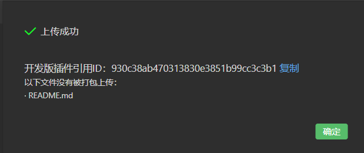

# 微信引擎插件发布测试流程

## 下载项目包


<https://github.com/cocos-creator/3d-wechat-engine-plugin>

直接使用 git 拉取项目或者下载 zip 包即可。

## 测试阶段

### 开发版引擎插件的生成、上传与基本测试 (每轮版本仅执行一次即可)

1. 使用已下载的项目包，用编辑器打开，**需要保证在编辑器内打开项目，以及预览都可以正常显示**

2. 创建一个微信构建任务，只勾选微信引擎分离选项、md5、以及生成插件选项（如下图，当前项目内放置了一个微信构建插件，在构建配置面板点击启用后直接构建就会生成对应的插件包。）


3. 使用微信开发者工具，用带有引擎插件开发权限的微信号登录后，打开项目目录下的 `cocosPlugin` 目录，并且确认是在**小游戏插件模式**下的即可。


4. 正常真机预览该项目，正常后点击上传，在弹出的弹框内查看线上版本号，**观察编辑器直接构建出来的微信包内 game.json 内 plugin.cocos.version 版本号是否大于线上版本号**。

5. 填写版本号为 game.json 内的对应版本号后，点击上传，并在上传后复制对应的 **开发版插件引用 ID**。


6. 运行之前编辑器内构建的微信任务，将 game.json 内的 `version` 改为 `dev-{ID}` (dev-3db3f3b76b2c831268ba21be18415bce)，观察是否可以正常运行。

7. 以上步骤在 mac 或 windows 上执行一次即可，后续使用另一个系统，构建一次微信包，重复 6 步骤，观察是否可以正常运行预览。

### 其他项目测试

构建微信版本号，将 `version` 修改为 `dev-xxx` 的形式测试即可。

## 最终发布

在开发版都测试正常后，直接通知对应管理员，发布对应的开发版本插件即可线上跟测。

## 发布方式


上传后，可以登录微信后台的小程序插件模块，开发版本看到开发版本插件


点击提交审核，再发布即可。

## 其他记录

自 1.2 起，实际需要上传的引擎插件放置在编辑器打包路径的 resources 文件夹下的 3d/engine/bin/.cache/editor-cache/wechat-game/cocos 目录下。
自 3.0 起，实际需要上传的引擎插件放置在编辑器打包路径的 resources 文件夹下的 3d/engine/bin/.cache/editor-cache/wechat-game/plugin 目录下。

手动拷贝微信引擎插件方式：

1. 清空`cocosPlugin/plugin` 目录，将 `3d/engine/bin/.cache/editor-cache/wechat-game/plugin` 路径下的所有文件，直接复制到 `cocosPlugin/plugin` 目录下。(仅需拷贝一次)

2. 使用微信开发者工具，用带有引擎插件开发权限的微信号登录后，打开 `cocosPlugin` 目录，并且确认是在**小游戏插件模式**下的即可。


3. 将构建成功的微信包除了 `cocos` 文件夹，复制到 `cocosPlugin/minigame` 文件夹内，并将项目内的 `game.json` 里的 `plugins` 字段改成下图所示。

```json
  "plugins": {
    "cocos": {
      "version": "dev",
      "provider": "wx0446ba2621dda60a"
    }
  }
```
